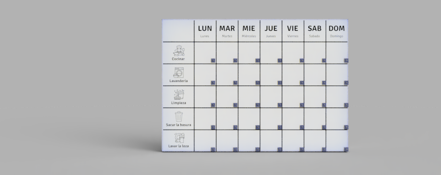
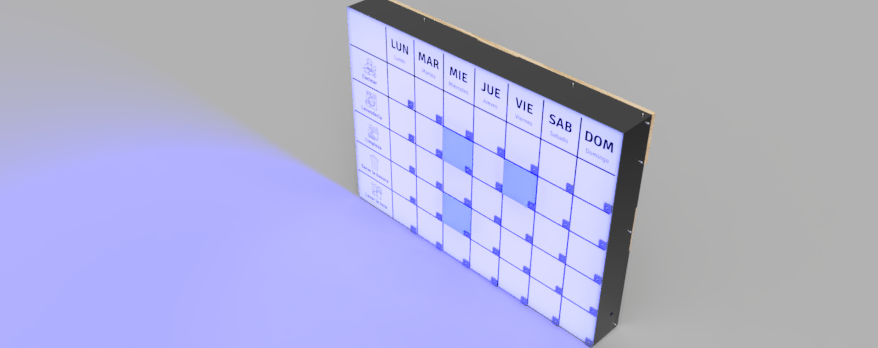
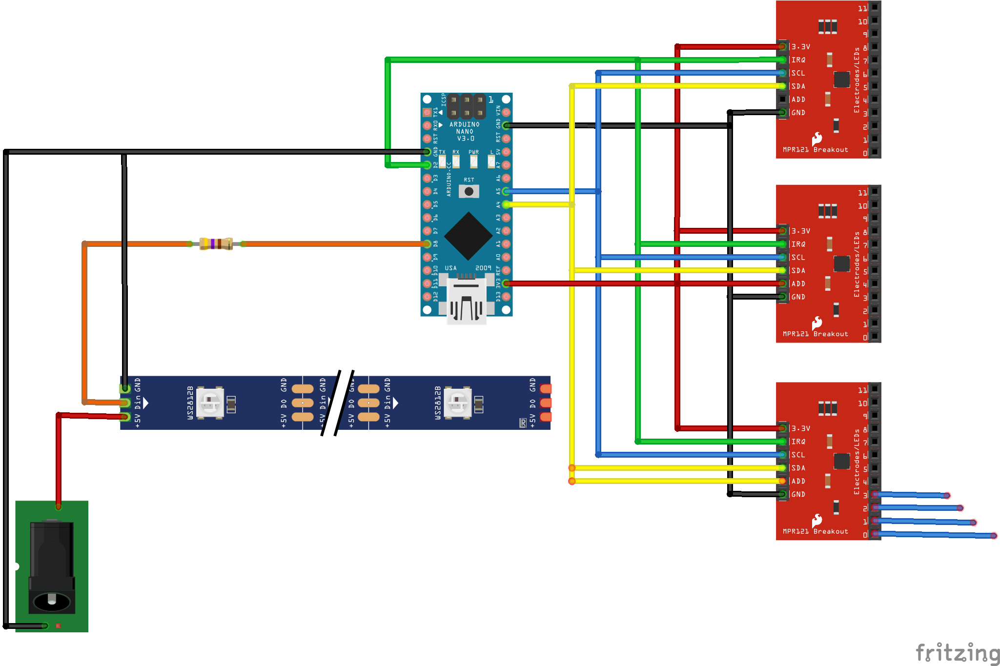
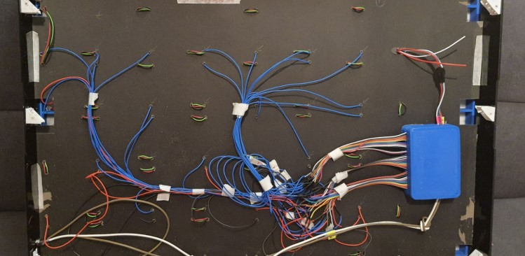
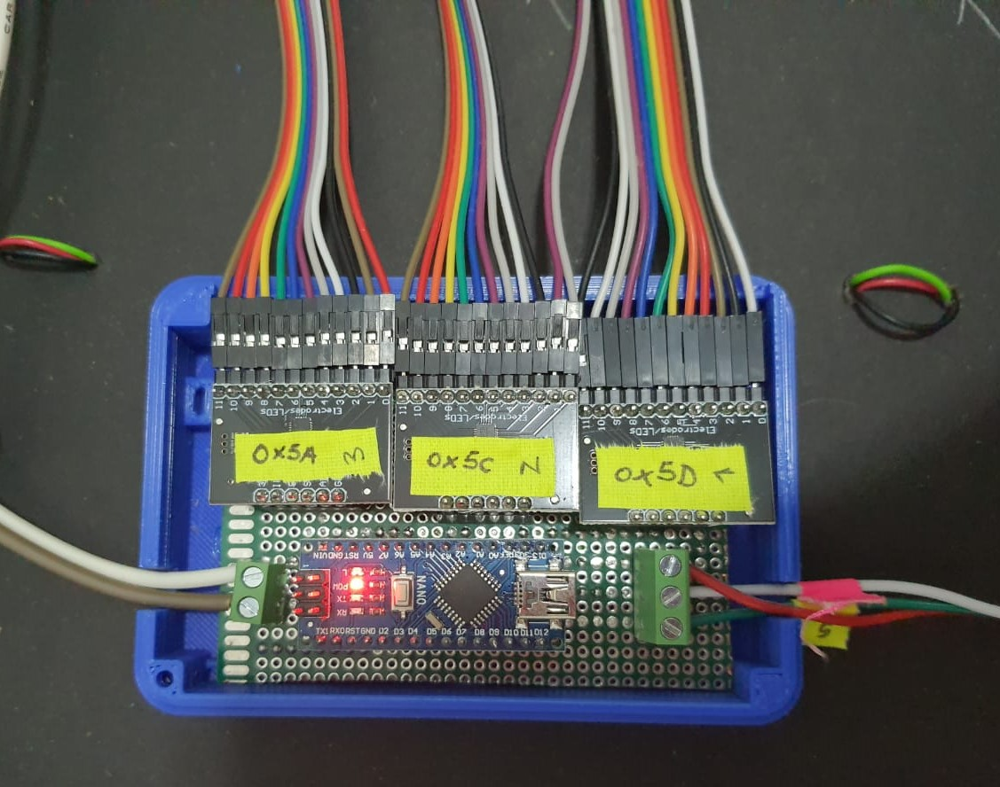
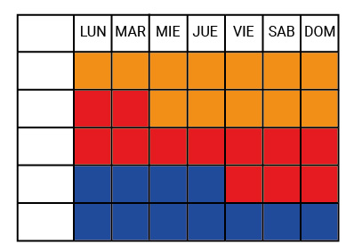
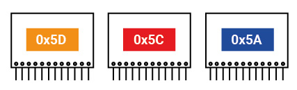

# Organicemos

## Contexto

[Para mayor información acerca de la investigación acerca de la investigación realizada en el proyecto de Apoyos a la vida independiente de adultos con discapacidad intelectual haga click aquí](https://wiki.ead.pucv.cl/Apoyos_a_la_vida_independiente_de_adultos_con_discapacidad_intelectual:_Organizador_colaborativo)

La vida independiente es considerada un derecho de las personas con discapacidad, además de ser un factor clave para el fomento de la calidad de vida de estas personas. Esta investigación se desarrolla en Chile, país en el que no se encuentran tan desarrolladas las materias de derechos ni oportunidades para la vida independiente de este grupo históricamente vulnerado. 

El panorama internacional actual demuestra que el uso de tecnologías asistivas como apoyo para diversos aspectos de la vida de las personas con discapacidad, pueden llegar a generar un cambio positivo en sus vidas.

Dentro de este mundo, se suelen encontrar aquellas que apoyan las funciones primarias de la vida de estas personas, las cuales se desarrollan en base a un estudio de sus capacidades. En este proyecto, a través de un proceso de diseño participativo, interdisciplinario e inclusivo se identifican las necesidades que las mismas personas con DI sienten importantes para fomentar su vida independiente. **Una de las necesidades sentidas por este grupo es la necesidad de apoyo para la organización.**


## Pizarra de organización colaborativa

[Para ingresar al repositorio de GitHub de Organicemos haga click aquí](https://github.com/accesibilidad-inclusion/organicemos/tree/gh-pages)

‘Organicemos’ es un organizador colaborativo, diseñado para **fomentar la participación de grupos convivientes a través de un sistema de tareas equitativo.** Este se ajusta a dos contextos de distinta escala, el primero se sitúa en una vivienda familiar. Este artefacto propone al grupo un plan semanal en base a las diversas capacidades de cada integrante y las tareas necesarias a realizar en el hogar, igualmente por medio de la confirmación de éstas se lleva un registro de aquellas tareas cumplidas y no cumplidas. Cumple además con la función de recordar a cada persona sus quehaceres en el momento que deben ser realizados, vuelve eficiente la organización de un espacio compartido.






## Sistema electrónico

El sistema electrónico del prototipo Organicemos se basa principalmente en el encendido y apagado de luces, el cual funciona a través de un sistema de sensores capacitivos los cuales se relacionan con el usuario por medio de pernos que funcionan como botones generando el cambio en las luces.

*En la imagen se muestran las conexiones electrónicas de los componentes del aparato para su funcionamiento*

##Validación interna

Tras la revisión del primer prototipo formal, se propone un proceso de validación, una evaluación que conste de tres niveles, comenzando con una **validación interna por parte del equipo desarrollador de los prototipos,** para luego dar cabida a una evaluación por parte del G.A -grupo asesor- y finalmente terminar con una evaluación en residencias.

Lo que se busca con esto, es que entre evaluaciones se puedan ir aplicando mejoras según las experiencias de cada usuario que lo testee, y que de esta manera, pueda llegar a un estado óptimo en cuanto a diseño y funcionalidad.

1. Las acciones de **encendido/apagado** no funcionan correctamente, lo cual dificulta probar la función principal de este prototipo.
2. La sensibilidad de los botones (este problema puede ser causa del anterior)

 
Debido a los problemas que han ocurrido por la sensibilidad de los sensores, se realizan pruebas con otros materiales, como cinta adhesiva de cobre, también se realizan pruebas desconectando las distintas partes del sistema electrónico. 
Durante estas pruebas se llega a la conclusión que el material del prototipo, ya sea de programación o del sistema electrónico, no se encuentran ordenados de manera que facilite el trabajo posterior con este. Es por esto que se propone un orden para entender la relación entre los sensores y las luces del panel.

*En la imagen se muestra el cableado del sistema electrónico interno del Organicemos*

*En la imagen se muestran los sensores MPR121 y la placa Arduino*

Para solucionar este problema y facilitar el futuro trabajo con el prototipo se propone un sistema de orden según colores, teniendo cada sensor un color asignado.

*Relación de color entre el panel y los sensores*

*Color asignado a cada sensor*

*Etiqueta en cada cable con el fin de reconocer que luz está encendiendo*












